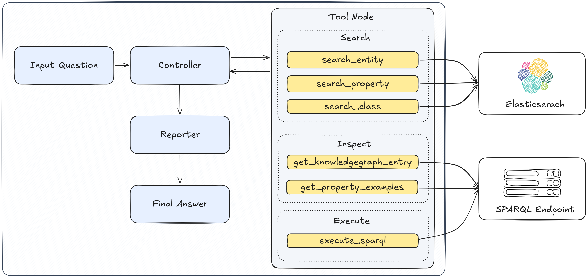

# VDT2026 OntoAgentQA

VDT2026 OntoAgentQA is a Vietnamese question-answering system over a Knowledge Graph/Ontology. It combines an LLM, Elasticsearch, and a SPARQL endpoint to turn natural-language questions into traceable retrieval and execution steps, then produces a final answer grounded in GraphDB/DBpedia evidence.

## Architecture



## Features

- Answer Vietnamese natural-language questions.
- Search DBpedia entities, properties, and classes through Elasticsearch.
- Inspect Knowledge Graph entries and property examples.
- Generate and execute read-only SPARQL `SELECT` and `ASK` queries.
- Track intermediate steps such as tool calls, generated SPARQL, and execution results.
- Benchmark multiple strategies: LLM-only, SPARQL generation, and SPARQL self-correction.

## Tech Stack

- Python
- LangGraph
- OpenRouter-compatible chat and embedding models
- Elasticsearch 8.x
- GraphDB-compatible SPARQL endpoint
- DBpedia ontology/data

## Project Structure

```text
.
|-- agents/
|   |-- ontology_qa_agent.py        # Main LangGraph agent
|   |-- kg_tools.py                 # SPARQL/KG inspection tools
|   |-- search_tools.py             # Elasticsearch search tools
|   `-- prompt/                     # Controller and reporter prompts
|-- data/                           # Dataset and RDF/ontology input
|-- docs/experiments/               # Experiment documentation
|-- elasticsearch/                  # Elasticsearch setup docs and search helper
|-- experiments/runners/            # CLI benchmark runners
|-- graphdb/                        # GraphDB repository/import docs and queries
|-- image/agent.png                 # System architecture diagram
|-- notebooks/                      # Experimental notebooks
|-- utils/
|   |-- build_index.py              # Build Elasticsearch indices
|   |-- test_kg_tools.py            # KG tools smoke test
|   |-- test_search_tools.py        # Search tools smoke test
|   `-- test_reporter_agent.py      # Reporter/finalization unit test
|-- .env.example
|-- docker-compose.yml
`-- requirements.txt
```

## Requirements

- Python 3.11+ is recommended.
- Docker and Docker Compose for local Elasticsearch.
- OpenRouter API key for the chat model and schema embeddings.
- A GraphDB-compatible SPARQL endpoint pointing to the DBpedia/OntologyQA repository.

## Installation

Create a Python environment and install dependencies:

```bash
conda create -n ontology-qa python=3.12
conda activate ontology-qa
pip install -r requirements.txt
```

## Configuration

The project uses environment variables to configure external services such as OpenRouter, GraphDB, and Elasticsearch. Create a local `.env` file from the provided template:

```bash
cp .env.example .env
```

Then update the required values:

```dotenv
OPENROUTER_API_KEY=your_openrouter_api_key
OPENROUTER_MODEL=google/gemma-4-26b-a4b-it
OPENROUTER_BASE_URL=https://openrouter.ai/api/v1

GRAPHDB_ENDPOINT=http://your-graphdb-host:7200/repositories/DBPEDIA
GRAPHDB_TIMEOUT=30

ELASTICSEARCH_URL=http://localhost:9200
ENTITY_INDEX=entity_index
SCHEMA_INDEX=schema_index
```

Key variables:

- `OPENROUTER_API_KEY`: API key used to call the LLM through OpenRouter.
- `OPENROUTER_MODEL`: chat model used by the controller and reporter agents.
- `OPENROUTER_BASE_URL`: OpenRouter-compatible API base URL.
- `GRAPHDB_ENDPOINT`: SPARQL endpoint used to execute generated queries.
- `GRAPHDB_TIMEOUT`: timeout in seconds for GraphDB requests.
- `ELASTICSEARCH_URL`: URL of the Elasticsearch instance used for retrieval.
- `ENTITY_INDEX`: Elasticsearch index for DBpedia entities.
- `SCHEMA_INDEX`: Elasticsearch index for ontology classes and properties.

## Create A GraphDB Repository

See [graphdb/README.md](graphdb/README.md) for GraphDB installation, repository creation, SPARQL endpoint configuration, and data import guidance.

## Prepare Elasticsearch Indices

See [elasticsearch/README.md](elasticsearch/README.md) for Elasticsearch setup, required data files, index building, and search tool verification.

## Run The Agent

The main agent is implemented in `agents/ontology_qa_agent.py` and is created with `build_ontology_qa_agent`.

Example invocation:

```python
from agents.ontology_qa_agent import build_ontology_qa_agent

graph = build_ontology_qa_agent(max_iterations=15)

result = graph.invoke({
    "question": "Có mấy tàu có cảng đăng ký tại Cam Ranh?",
    "options": [
        {"id": 1, "text": "4"},
        {"id": 2, "text": "5"},
        {"id": 3, "text": "6"},
        {"id": 4, "text": "7"},
        {"id": 5, "text": "8"},
    ],
})

print(result)
```

To inspect intermediate steps, stream graph updates:

```python
for event in graph.stream(
    {
        "question": "Có mấy tàu có cảng đăng ký tại Cam Ranh?",
        "options": [],
    },
    stream_mode="updates",
):
    print(event)
```

## Tests

Run the SPARQL/KG tools smoke test:

```bash
python utils/test_kg_tools.py
```

Run the Elasticsearch search tools smoke test:

```bash
python utils/test_search_tools.py
```

Run the reporter logic test:

```bash
python utils/test_reporter_agent.py
```

## Experiments

Detailed experiment documentation:

- `docs/experiments/llm-only.md`
- `docs/experiments/sparql-generation.md`
- `docs/experiments/sparql-self-correction.md`

Default benchmark dataset:

```text
data/ontologyqa_test_questions_v1.csv
```

Run a smoke test for each baseline:

```bash
python experiments/runners/llm_only.py --limit 1
python experiments/runners/sparql_gen.py --limit 1
python experiments/runners/sparql_self_correct.py --limit 1
```

Run the full benchmark:

```bash
python experiments/runners/llm_only.py
python experiments/runners/sparql_gen.py
python experiments/runners/sparql_self_correct.py
```

Results are written to:

```text
experiments/results/
```

## Troubleshooting

- `Missing OPENROUTER_API_KEY`: make sure `.env` exists and contains `OPENROUTER_API_KEY`.
- `Elasticsearch search failed`: see [elasticsearch/README.md](elasticsearch/README.md) and make sure Elasticsearch is running and indices have been built.
- `OPENROUTER_API_KEY is required when ENABLE_SCHEMA_DENSE=true`: provide an API key or set `ENABLE_SCHEMA_DENSE=false` if you only need lexical schema indexing.
- `GraphDB SPARQL query failed`: see [graphdb/README.md](graphdb/README.md) and check `GRAPHDB_ENDPOINT`, network access, repository name, and timeout settings.
- SPARQL aggregate alias errors: aggregate expressions in `SELECT` must be aliased, for example `SELECT (COUNT(?item) AS ?count) WHERE { ... }`.

## Notes

- The Controller must not rely on result copies invented by the LLM. The final answer must correspond to real execution evidence.
- For multiple-choice questions, answer options are handled at the reporter stage to avoid leaking choices into neutral SPARQL generation.
